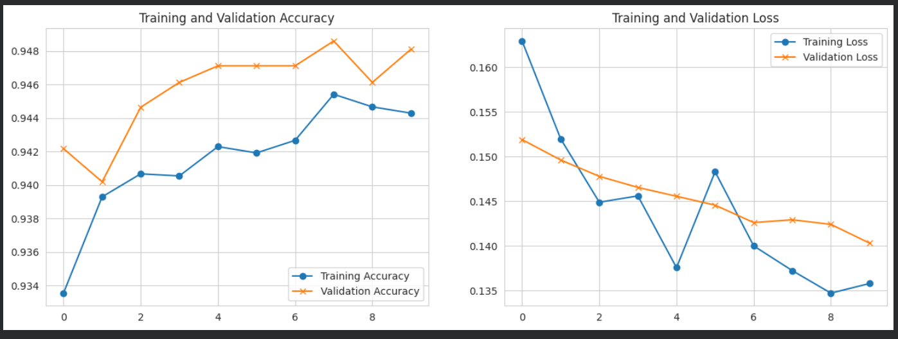
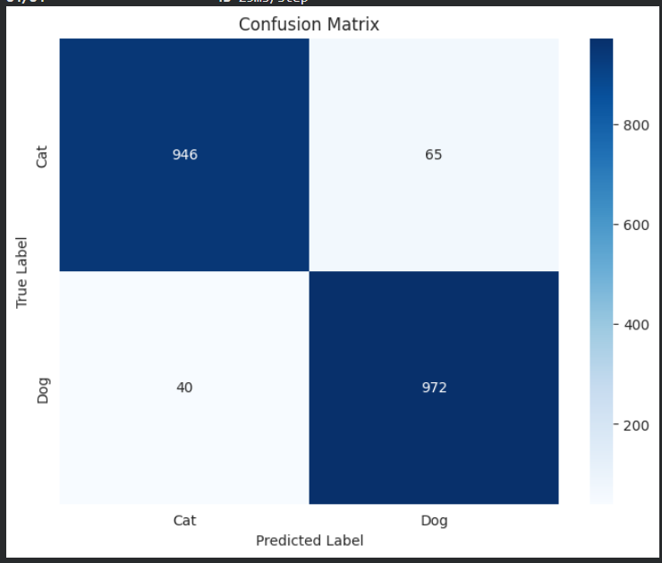
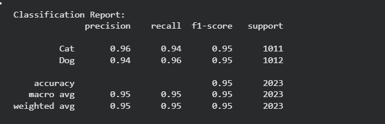
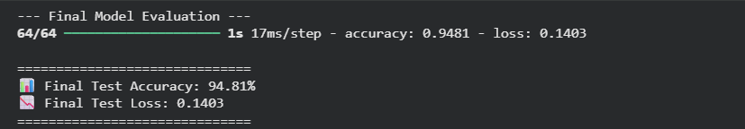
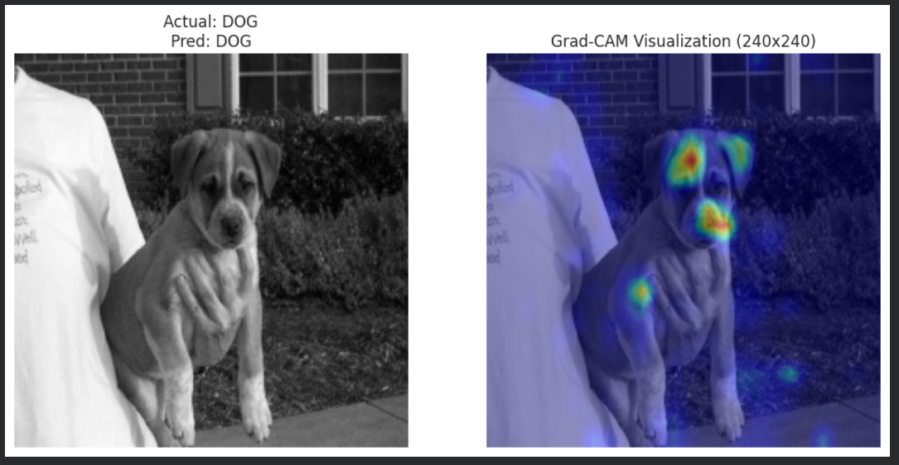
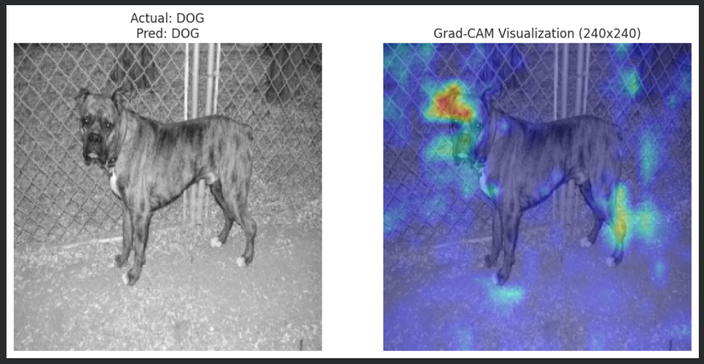
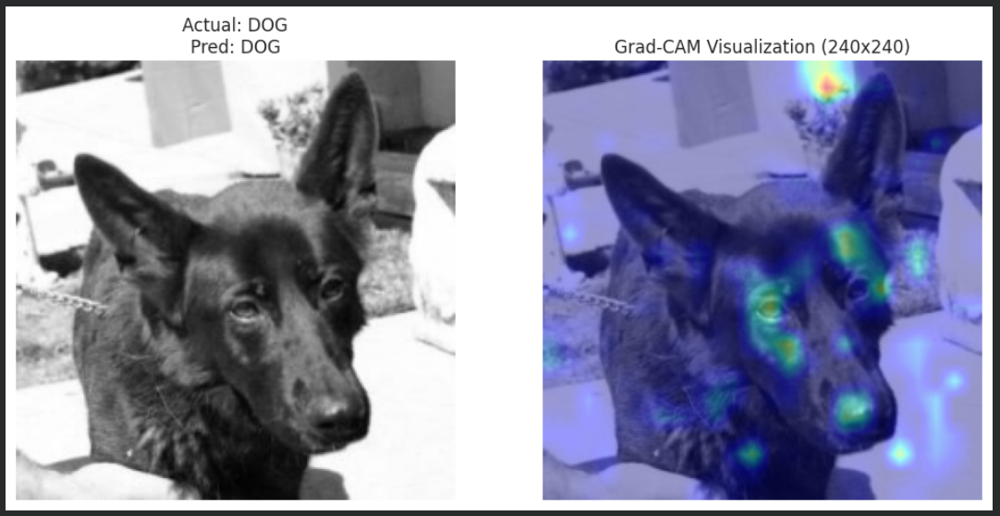

# Cats-vs-Dogs-Classification-FromScratch-Optimization
A high-performance custom CNN for Cats vs Dogs classification, achieving 94.81% accuracy with model interpretability using Grad-CAM

# 🐾 Cats vs Dogs Classification from Scratch: The Optimization Journey (95% Accuracy)

---

## 📝 Project Overview | نظرة عامة على المشروع

### **English**
This project focuses on building a robust Convolutional Neural Network (CNN) from scratch to classify images of cats and dogs. The main goal was to demonstrate the power of **Model Optimization** and **Explainable AI (XAI)**. I managed to push the model's performance from an initial **83%** baseline to a highly reliable **94.81%** accuracy without using Transfer Learning.

### **بالعربي**
يركز هذا المشروع على بناء شبكة عصبية تلافيفية (CNN) قوية من الصفر لتصنيف صور القطط والكلاب. الهدف الأساسي كان إثبات قوة **تحسين النماذج (Optimization)** و **الذكاء الاصطناعي القابل للتفسير (XAI)**. نجحت في تطوير أداء النموذج من دقة مبدئية **83%** إلى دقة عالية تصل إلى **94.81%** دون الاعتماد على نماذج جاهزة (Transfer Learning).

---

## 🚀 Optimization Strategy | استراتيجية التحسين

To achieve the 12% accuracy boost, the following techniques were implemented:
لتحقيق قفزة بنسبة 12% في الدقة، تم تنفيذ التقنيات التالية:

1.  **Architecture Tuning:** Added **Batch Normalization** for faster convergence and **Dropout** layers (0.5) to combat overfitting.
2.  **Advanced Data Augmentation:** Implemented a real-time augmentation pipeline (rotation, zoom, horizontal flips) using `ImageDataGenerator`.
3.  **Hyperparameter Optimization:** Switched to the **Adam** optimizer with a fine-tuned learning rate.

---

## 📊 Evaluation Metrics | مقاييس الأداء

The model was evaluated on a test set of **2,023 unseen images**:

* **Final Test Accuracy:** 94.81%.
* **Final Test Loss:** 0.1403.
* **Precision/Recall:** Balanced scores (~0.95) for both classes.

| Metric | Score |
| :--- | :--- |
| **Accuracy** | 94.81% |
| **F1-Score (Cats)** | 0.95 |
| **F1-Score (Dogs)** | 0.95 |

---

## 🔍 Explainable AI (Grad-CAM) | تفسير النموذج

### **English**
Beyond accuracy, I integrated **Grad-CAM** (Gradient-weighted Class Activation Mapping) to visualize where the model looks. This ensures the model identifies specific features like ears, eyes, and fur textures.

### **بالعربي**
بعيداً عن الأرقام، قمت بدمج تقنية **Grad-CAM** لرؤية المناطق التي يركز عليها النموذج لاتخاذ قراره. هذا يضمن أن الموديل يتعرف على ملامح حقيقية مثل الأذنين، العينين، وفرو الحيوان.

---

## 🛠️ Tech Stack | الأدوات المستخدمة

* **Language:** Python.
* **Frameworks:** TensorFlow / Keras.
* **Libraries:** NumPy, Matplotlib, OpenCV, Scikit-learn.
* **Platform:** Google Colab.

---

## 📈 Visualizations | الرسوم البيانية

*(Tip: Upload your screenshots to your GitHub repo and link them here)*
* **Training History:** Stable curves for accuracy and loss.
* **Confusion Matrix:** High true positive/negative rates.
* **Grad-CAM Heatmaps:** Visual proof of model intelligence.

---

## 📈 Visualizations & Results | النتائج والرسوم البيانية

### 1. Model Training History (Accuracy & Loss)

**Description**

These learning curves demonstrate the stability and performance of the CNN model over 10 epochs.

​**Accuracy Curve:** Shows a consistent upward trend for both training and validation accuracy, peaking at ~95%, with no significant gap, indicating a well-generalized model.

**Loss Curve:** Displays a smooth decline in both training and validation loss, confirming that the model effectively minimized errors without suffering from overfitting.

​العربية:

​توضح هذه المنحنيات البيانية استقرار وأداء نموذج الـ CNN خلال 10 دورات تدريبية (Epochs):

**​منحنى الدقة (Accuracy):** يظهر اتجاهاً تصاعدياً مستمراً لكل من دقة التدريب والاختبار، حيث وصلت الدقة إلى حوالي 95% مع تقارب واضح بين المنحنيين، مما يدل على قدرة النموذج على التعميم بشكل ممتاز.

**​منحنى الخسارة (Loss):** يظهر انخفاضاً تدريجياً وسلساً في قيم الخسارة، مما يؤكد نجاح النموذج في تقليل الأخطاء بكفاءة عالية دون الوقوع في مشكلة الـ Overfitting

### 2. Confusion Matrix

**Description**

This Confusion Matrix shows the high performance of the model on the test set. Out of 2,000+ images, the model correctly identified 972 Dogs and 946 Cats, achieving a balanced and high accuracy across both classes.

​العربية:

​توضح مصفوفة الارتباك (Confusion Matrix) الأداء العالي للنموذج على بيانات الاختبار. من بين أكثر من 2000 صورة، نجح النموذج في تحديد 972 كلب و946 قطة بشكل صحيح، مما يعكس دقة متوازنة وقوية لكلا الفئتين

### 3. Classification Report

**Description**

The classification report provides a deep dive into the model's performance:

​**Precision & Recall:** Both classes (Cat and Dog) achieved high scores (0.94 - 0.96), meaning the model is equally good at identifying both and rarely makes false positive/negative errors.

​**F1-Score:**An impressive 0.95 for both classes confirms the robustness and balance of the classifier.
​Support: Tested on 2,023 images, ensuring the results are statistically significant.

​العربية:

​يوضح تقرير التصنيف (Classification Report) تفاصيل دقيقة لأداء النموذج:

**​الدقة والاستدعاء (Precision & Recall):** حقق النموذج نتائج عالية جداً لكلا الفئتين (بين 0.94 و 0.96)، مما يعني أن الموديل متوازن تماماً في التعرف على القطط والكلاب على حد سواء.
​
**F1-Score:** الوصول لـ 0.95 يؤكد قوة النموذج وقدرته على اتخاذ قرارات صحيحة ومستقرة.

### 4. Final Evaluation Results

**Description**

The final evaluation on the unseen test set confirms the model's high reliability:

​**Test Accuracy: 94.81%,** demonstrating that the model has successfully learned to generalize and distinguish between cats and dogs with high precision.
​**Test Loss: 0.1403,** indicating a very low error rate and high confidence in the model's predictions.

This result validates the effectiveness of the custom CNN architecture and the optimization techniques applied throughout the project.

​العربية:

​التقييم النهائي على بيانات الاختبار (Unseen Test Set) يؤكد مدى موثوقية النموذج:

**​دقة الاختبار النهائية: 94.81%،** مما يثبت نجاح النموذج في التمييز بين القطط والكلاب بدقة عالية وقدرة ممتازة على التعميم.

**​نسبة الخطأ (Loss): 0.1403،** وهي نسبة ضئيلة جداً تعكس ثقة النموذج العالية في توقعاته.

هذه النتيجة هي تتويج لمعمارية الـ CNN المخصصة وتقنيات التحسين التي تم تطبيقها خلال المشروع.

### 5. Explainable AI (Grad-CAM Visualizations)
| Sample 1 | Sample 2 | Sample 3 |
| :---: | :---: | :---: |
|  |  |  |

---

## 👨‍💻 Author

**Mohamed Belal**

* Data Science & AI Diploma (AMIT Learning)

